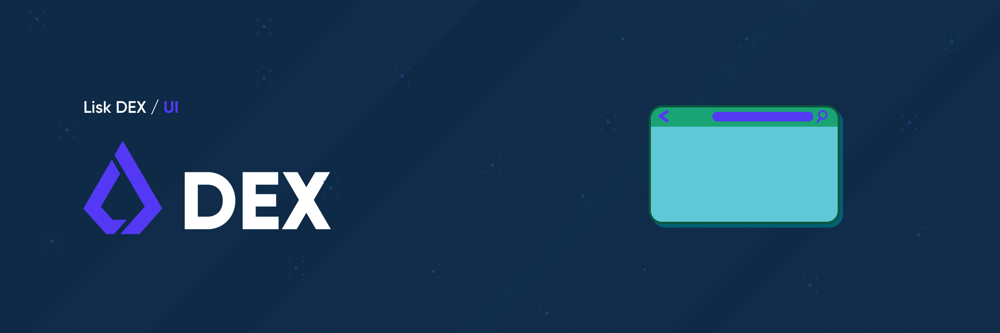

# Lisk DEX UI

Lisk DEX UI is an interactive user-interface and lean frontend for the DEX v1.0.0 and makes the user's interaction as simple and efficient as possible, in terms of accomplishing user goals.

## Dependencies

The following dependencies need to be installed in order to run applications created with the Lisk SDK.

| Dependencies            | Version |
| ----------------------- | ------- |
| NodeJS                  | 16.14.2 |
| Python (for developmen) | 2.7.18  |


## Install
```
$ git clone https://github.com/LiskHQ/lisk-dex-ui.git
$ cd lisk-dex-ui
$ yarn build
$ yarn start
```

## Technical Stack

-   Languages: HTML5, CSS, Typescript, Python, Bash

-   Frameworks:

    -   Next.js (latest)

    -   Socket.io

    -   Lisk DEX Libraries

    -   Custom utility libraries

    -   Styled Components

-   Third party libraries:

    -   Trading view light weight charts

    -   Material UI

    -   Axios

-   Code Formatting and Quality: ESLint, Prettier, Prettier VSCode Extension and DeepScan

-   Testing: Jest, Cypress

-   CI/CD: Git, Jenkins, Docker, VPS

-   Database: AWS S3

-   Version Control: GitHub

## Testing

### Unit tests

#### Single run

```
yarn test
```

## Contributors

See [contributors section](https://github.com/LiskHQ/lisk-dex-ui/graphs/contributors).

## License

Copyright 2016-2022 Lisk Foundation

Licensed under the Apache License, Version 2.0 (the "License"); you may not use this file except in compliance with the License. You may obtain a copy of the License at

<http://www.apache.org/licenses/LICENSE-2.0>

Unless required by applicable law or agreed to in writing, software distributed under the License is distributed on an "AS IS" BASIS, WITHOUT WARRANTIES OR CONDITIONS OF ANY KIND, either express or implied. See the License for the specific language governing permissions and limitations under the License.